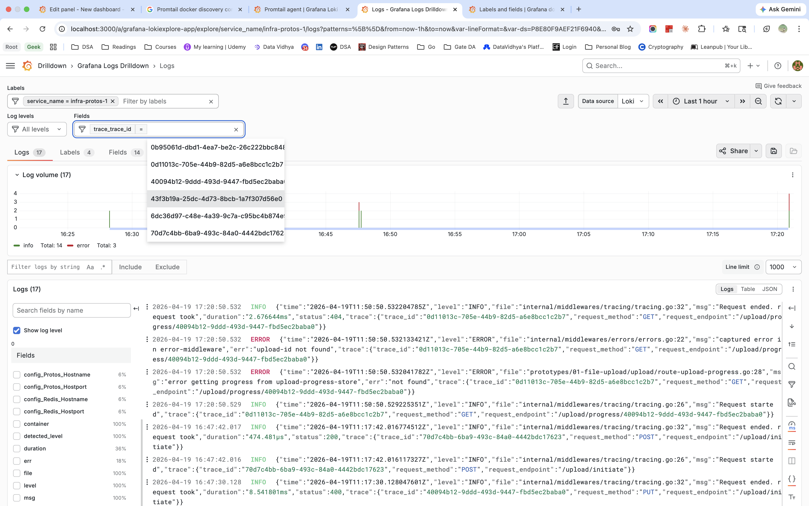

# Observability Journey

A running journal of everything learned about observability — logging, metrics, tracing, and the infrastructure that supports them. Built up incrementally as each prototype adds observability depth.

---

## Chapter 1: What Logging Actually Is

### stdout is not a file — it's fd=1

When a Go program calls `fmt.Fprintf(os.Stdout, ...)`, it writes to file descriptor 1. By default fd=1 points to the terminal. But fd=1 is just a number — the kernel maps it to whatever inode was wired up before the process started.

```
./app                         → fd=1 points to terminal
./app >> /var/log/app.log     → shell rewires fd=1 to app.log's inode before exec
systemd service               → systemd captures fd=1, pipes to journald
Docker container              → Docker captures fd=1, writes to JSON log file on host
```

The app never knows or cares. It always writes to fd=1.

### File descriptors and inodes are separate concepts

```
Process fd table              open file table          inode (on disk)
fd=1  ──────────────────────► file description ──────► inode:42 (app.log data)
```

- **fd table**: per-process, maps integers to file descriptions
- **inode**: the actual file — data blocks, permissions, size. No filename.
- **filename**: just a directory entry pointing to an inode. Multiple names can point to the same inode (hard links).

`mv app.log app.log.1` only updates the directory entry. The inode stays at inode:42. Any process with fd=1 pointing to inode:42 keeps writing there — it doesn't know the filename changed.

### Notes from first principles (refreshed from engineering college)

- A file descriptor is just an integer assigned for each file (inode) a process opens
- A file (inode) can be pointed to by multiple processes simultaneously
- On closing a file (`defer tmp.Close()`), the kernel releases the file descriptor integer from the process — that integer can then be reassigned to the same process for any other file it opens next
- This is why it's important to `defer` closing opened files — leaked fd integers accumulate and the kernel has a per-process fd limit
- Renaming a file changes nothing at the inode level — the inode number, data blocks, and any open file descriptors pointing to it are completely unaffected
- A file descriptor points to an inode and has nothing to do with the filename after the initial `open()` call — the filename is only used once to resolve the inode, then never consulted again
- Each process has its own fd table — fd=1 in process A and fd=1 in process B are completely unrelated integers pointing to different inodes
- When logrotate renames the original log file and creates an empty `app.log`, the process's file descriptors know nothing about it — unless explicitly notified via a signal (conventionally `SIGHUP`)
- On receiving `SIGHUP`, the **app** (not the kernel) closes the old fd and reopens `app.log` by name — the kernel doesn't rewire anything automatically. The signal is just a knock on the door; the app decides what to do

### In Go terms

```go
os.OpenFile("app.log", ...)   // filename used once here — kernel resolves to inode
    → returns *os.File         // wraps an fd integer, filename forgotten

file.Write(data)               // kernel uses fd → inode directly, filename never consulted
```

`*os.File` is just a wrapper around an integer fd. `io.Writer` is the interface over it. Neither knows about filenames after construction.

### Why logrotate exists

Log files grow forever. Logrotate runs on a schedule and:

1. `mv app.log → app.log.1` — preserves old content
2. `touch app.log` — creates new empty file (new inode)
3. `kill -HUP <pid>` — signals app to reopen by name
4. App closes old fd, opens `app.log` by name → gets new inode

Without step 3+4, the app keeps writing to `app.log.1`'s inode. The new `app.log` stays empty.

**`copytruncate` alternative:** copy content to `app.log.1`, then truncate the original inode to zero bytes. No signal needed — app keeps writing to the same inode which is now empty. Small data loss window between copy and truncate.

**Key insight:** logrotate only matters when stdout is redirected to a file. In Docker/Kubernetes, the platform handles this — your app just writes to stdout.

### The 12-factor answer

Write to stdout. Always. Let the platform collect, rotate, and ship logs. The app has one job: emit structured log lines to fd=1.

---

## Chapter 2: Structured Logging in Go

### Why `log/slog` over `fmt.Println`

Unstructured:
```
2026-04-19 10:58:14 Request ended in 8.2s with status 200
```

Structured JSON:
```json
{"time":"2026-04-19T10:58:14Z","level":"INFO","msg":"Request ended","duration":"8.2s","status":200,"trace_id":"abc123"}
```

Every field is machine-parseable. Log aggregators (Loki, CloudWatch, Elasticsearch) index each field. You can query `duration > 5s` or `trace_id = "abc123"` without regex.

### How `slog` handles concurrent writes

`slog`'s built-in handlers (`JSONHandler`, `TextHandler`) use a mutex:

```go
type JSONHandler struct {
    mu *sync.Mutex
    w  io.Writer
}

func (h *JSONHandler) Handle(ctx context.Context, r Record) error {
    h.mu.Lock()
    defer h.mu.Unlock()
    // format entire record
    // write complete JSON line
}
```

Multiple goroutines serialize at the handler level. Each log line is written as a complete JSON object — no interleaving.

### Why zerolog is faster

`slog` holds the mutex for the entire format+write operation. `zerolog` moves formatting outside the mutex:

```
slog:    [mutex: format + write]
zerolog: format (lock-free, per-goroutine pool buffer) → [mutex: write only]
```

`zerolog` uses `sync.Pool` — each CPU core has its own pool slot, goroutines format in parallel. The mutex only protects the tiny write syscall. At very high log volume this matters. For most production services, `slog` is fine.

### `sync.Pool` — deep dive

`sync.Pool` is a pool of reusable objects. The key property: getting an object is lock-free in the common case.

**Why pools exist — the allocation problem:**

Without a pool, every log call allocates a scratch buffer, uses it, discards it:
```
1000 requests/sec = 1000 buffer allocations/sec → GC pressure
```

With a pool, the same buffers circulate — allocated once, reused continuously. GC has nothing to collect at steady state.

**Basic usage:**
```go
var pool = &sync.Pool{
    New: func() any {
        return bytes.NewBuffer(make([]byte, 0, 1024))
    },
}

buf := pool.Get().(*bytes.Buffer)  // checkout
buf.WriteString(`{"level":"INFO"}`)
buf.Reset()
pool.Put(buf)                       // checkin
```

`Get()` returns `any` — type-assert to what you stored. `New` called only when pool is empty.

**Why it's lock-free — per-P slots:**

Go scheduler has P processors (one per CPU core by default). Every goroutine runs on a P. `sync.Pool` gives each P its own local slot:

```
Pool
  local[0] → buf   (P0's slot)
  local[1] → buf   (P1's slot)
  local[2] → nil   (P2's slot, empty)
  local[3] → buf   (P3's slot)
```

`Get()` checks own P's slot first — just an array read, no lock. Only on miss does it check other P's slots (with lock) or call `New`. Under normal concurrency, most operations never contend.

**Pool can hold more than N buffers — poolChain:**

One slot per P is just the fast path. Each P also has a `poolChain` — a lock-free overflow queue. Under a traffic spike with 1000 concurrent goroutines, 1000 buffers circulate across local slots and poolChains.

```
P0: local slot = buf_1
    poolChain  = [buf_5, buf_9, buf_13, ...]
```

Pool size is unbounded — limited only by RAM. It self-tunes to actual concurrency.

**The GC problem and victim cache:**

The GC needs to reclaim idle buffers after a traffic spike subsides, otherwise memory grows to the spike's high watermark and stays there. But if GC wipes all buffers every cycle, every post-GC `Get()` calls `New()` — an allocation spike.

`sync.Pool` solves this with a two-generation system:

```
Pool
  local[]   — current cycle's buffers
  victim[]  — previous cycle's buffers
```

Before each GC cycle, `poolCleanup()` runs (registered with the runtime):
```go
func poolCleanup() {
    victim = nil          // drop old victim → GC collects those objects
    victim = local        // promote local to victim
    local = nil           // local becomes empty
}
```

After GC:
```
Get(): local[P] miss → victim[P] hit → buffer reused, no allocation
```

Buffers survive **two GC cycles** after going idle — one cycle in local, one in victim. Memory reclaim takes two cycles, but no allocation spike. The trade-off: slightly delayed reclaim in exchange for smooth behaviour.

**After a spike:**
```
Spike ends     → 1000 buffers sitting idle in local + poolChain
GC cycle 1     → local promoted to victim (1000 buffers still alive)
GC cycle 2     → victim freed (1000 buffers collected)
Steady state   → pool settles at ~concurrency-level buffers
```

**`sync.Pool` struct from source:**
```go
type Pool struct {
    local     unsafe.Pointer // [P]poolLocal — per-P slots
    localSize uintptr
    victim     unsafe.Pointer // previous cycle's local
    victimSize uintptr
    New func() any
}
```

`unsafe.Pointer` instead of a typed slice because P count is only known at runtime (`GOMAXPROCS`), not compile time.

**zerolog's full picture with pool:**
```
Get buffer from pool (lock-free, own P's slot)
  → format JSON into buffer (no lock, parallel across goroutines)
  → mutex → write buffer to fd=1 → release mutex
  → Reset buffer → Put back to pool
```

Formatting — the expensive part — happens entirely outside the mutex. The mutex window is just the write syscall.

### Trace ID propagation via context

Every request gets a UUID trace ID in the tracing middleware. It's stored in `context.Context` and extracted in every log call:

```go
func (l *Logger) write(ctx context.Context, ...) {
    trace, _ := tracing.GetTrace(ctx)
    r.Add("trace", trace)  // attached to every log record
}
```

Result: every log line from every layer (handler, store, writer) carries the same `trace_id`. In Grafana, filter by one trace ID to see the entire request lifecycle.

---

## Chapter 3: The Grafana + Loki + Promtail Stack

### What each piece does

**Loki** — log storage and query engine. Stores compressed log chunks, indexes only labels (not full text). Much cheaper than Elasticsearch. Query language is LogQL.

**Promtail** — log collector. Tails files, attaches labels, pushes to Loki via HTTP. Deprecated as of March 2026 — replacement is Grafana Alloy. Still works and has simpler config for learning.

**Grafana** — visualization frontend. Queries Loki (and other datasources), renders logs, histograms, dashboards. Stores almost nothing itself.

### The full pipeline

```
App stdout
  → Docker → /var/lib/docker/containers/<id>/<id>-json.log (host)
  → Promtail tails file, attaches labels {container, service_name, stream}
  → HTTP POST batches → Loki (http://loki:3100/loki/api/v1/push)
  → Loki indexes labels, compresses log chunks
  → Grafana LogQL query → Loki → parsed JSON fields → rendered in browser
```

### Why Promtail needs two mounts

```yaml
- /var/run/docker.sock:/var/run/docker.sock
- /var/lib/docker/containers:/var/lib/docker/containers:ro
```

`docker.sock` — Docker API socket. Promtail asks Docker: "which containers are running, what labels do they have, where are their log files?" This is service discovery.

`/var/lib/docker/containers` — the actual log files on the host. Promtail reads from here. `:ro` — read-only, least privilege.

### Label filtering

```yaml
filters:
  - name: label
    values: ["logging=promtail"]
```

Without this, Promtail tails every container. App compose service must have:

```yaml
labels:
  logging: promtail
```

### Relabeling — from Docker metadata to Loki labels

Docker SD exposes `__meta_docker_*` internal labels. Relabeling maps them to queryable Loki labels:

```yaml
relabel_configs:
  - source_labels: ["__meta_docker_container_name"]
    regex: "/(.*)"
    target_label: "container"
```

`/infra-protos-1` → regex strips leading `/` → `container = infra-protos-1`

### Grafana datasource provisioning

Grafana reads `/etc/grafana/provisioning/datasources/` on startup — no manual UI setup needed:

```yaml
apiVersion: 1
datasources:
  - name: Loki
    type: loki
    url: http://loki:3100
    access: proxy  # Grafana server proxies to Loki, browser never talks to Loki directly
```

### LogQL — querying structured logs

```logql
{container="infra-protos-1"}                          → all logs from app
{container="infra-protos-1"} | json                   → parse JSON fields
{container="infra-protos-1"} | json | status = 200    → filter by status
{container="infra-protos-1"} | json | duration > "5s" → slow requests
{container="infra-protos-1"} | json | trace_id = "abc" → single request lifecycle
```

### What the payoff looks like

With structured JSON logging + Loki + Grafana:

- Every request traceable by `trace_id` across all log lines
- ERROR logs highlighted in red automatically (`detected_level` label)
- Duration histogram shows request latency distribution
- Config values logged at startup appear as queryable fields
- Log volume chart shows traffic spikes visually

---

## Chapter 4: How Large-Scale Logging Works

### The architecture

```
App (stdout)
  → Log collector (Promtail / Fluent Bit / CloudWatch Agent)
      buffers locally if downstream is slow
      handles log rotation awareness (inotify)
  → Log aggregator (Loki / Elasticsearch / CloudWatch Logs)
      indexes, compresses, partitions by time
      retention policies delete old partitions
  → Query layer (Grafana / Kibana / CloudWatch Insights)
      queries index first, then fetches matching chunks
      never full-scans raw log files
```

### Why the collector exists

Your app can't buffer and retry failed log shipments — it has other work to do. The collector handles:
- Backpressure (downstream slow → collector queues)
- Retry on failure
- Batching (fewer HTTP calls to Loki)
- Log rotation awareness (file renamed → re-open by new path)

### How Loki stores at scale

Logs partitioned by log group + time window. Old partitions compressed and tiered to cheaper storage. Retention deletes entire time-range partitions — cheap at the storage layer.

When you query, Loki hits the label index first to find matching partitions, then scans only those. Never full-scans everything.

### CloudWatch vs Grafana stack

| | CloudWatch | Grafana + Loki |
|---|---|---|
| Storage | AWS managed | You run it |
| Cost | Per GB ingested/stored/queried | Your infra cost |
| AWS integration | Native (EC2, ECS, Lambda) | Needs config |
| Vendor lock-in | AWS only | Any cloud or on-prem |
| Setup | Zero | Non-trivial |

Common pattern: CloudWatch for AWS infrastructure metrics (free from AWS services), Grafana+Loki for application logs (cheaper at high volume).

### The cost model reality

CloudWatch charges per GB ingested, stored, and queried. At scale:
- Verbose DEBUG logs in production = real money
- Production standard: INFO and above only
- Set retention to legal minimum
- Sample high-volume low-value logs (health check hits)

**What sampling means:** Health check endpoints (`GET /health`, `GET /ping`) are hit every few seconds by load balancers, Kubernetes liveness probes, and monitoring systems — thousands of identical 200 OK lines per hour, all useless for debugging. At high traffic they can account for 30-40% of total log ingestion volume and cost.

Sampling logs only 1 in every N of these:

```go
if endpoint == "/health" && rand.Intn(100) != 0 {
    return // skip logging this one
}
```

You still have evidence the endpoint is alive, at 1% of the cost. High-value logs (errors, slow requests, business events) are never sampled — you want every single one of those.

---

## Bugs and Lessons

| Issue | Cause | Fix |
|-------|-------|-----|
| Only startup logs in Grafana | Promtail started after app, missed existing log lines | Restart app after Promtail is running |
| `500: Ingester is shutting down` | Promtail pushed before Loki finished starting | `depends_on: loki` in compose |
| Promtail not discovering containers | Missing `logging=promtail` Docker label on app | Add label to app's compose service |
| Can't reach `localhost:9080` | Promtail port not exposed in compose | Add `ports: - 9080:9080` |
| Wrong time range in Grafana | App logs in UTC, browser in IST | Set Grafana timezone to UTC or adjust time range |

---

## File Structure

```
infra/
  docker-compose.yaml              → app services (protos + Redis)
  observability/
    docker-compose.yaml            → Grafana + Loki + Promtail
    loki-config.yaml               → filesystem storage, single-node
    grafana-config.yaml            → Loki datasource provisioning
    promtail-config.yaml           → Docker SD, label extraction, Loki push
```

---

## Grafana Drilldown — Live Screenshot

Structured JSON fields parsed and queryable. `trace_id` autocomplete showing all request IDs. ERROR log highlighted in red. `duration`, `file`, `status`, `container`, `stream` all indexed as fields.



---

## What's Next

- Alloy migration (Promtail replacement)
- Metrics with Prometheus + Grafana
- Distributed tracing with Tempo + OpenTelemetry
- CloudWatch setup for AWS deployment
- Alerting rules in Grafana
